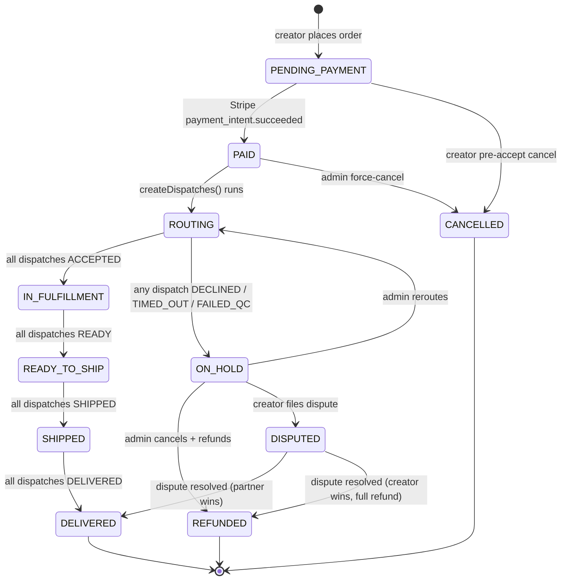
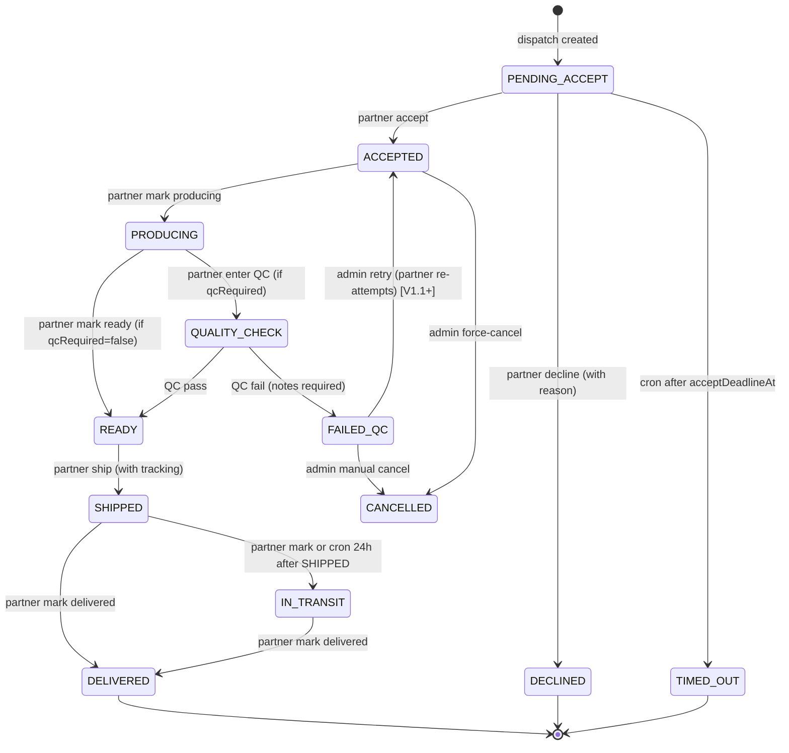
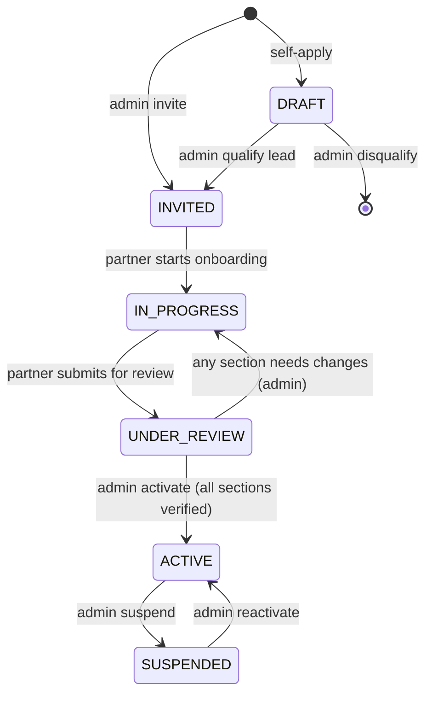
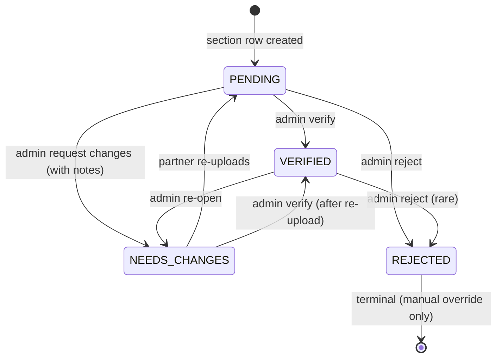
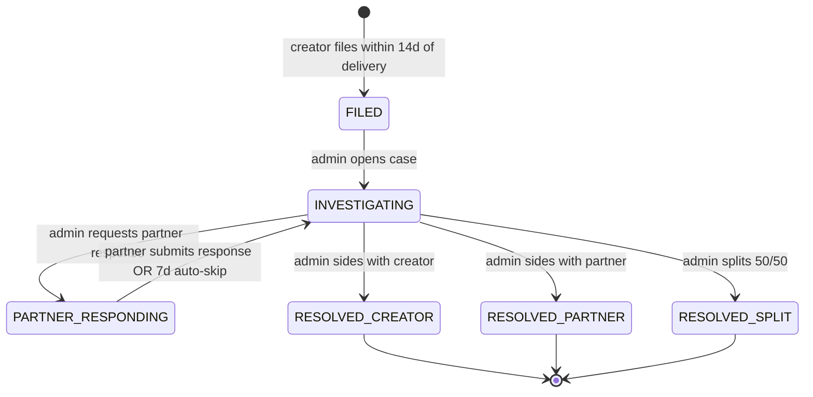
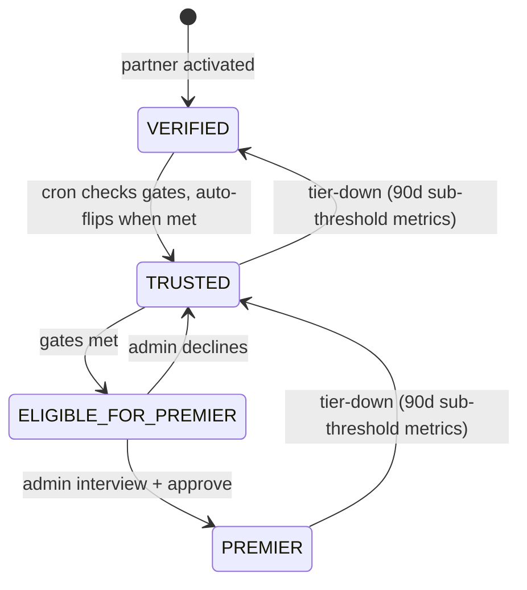
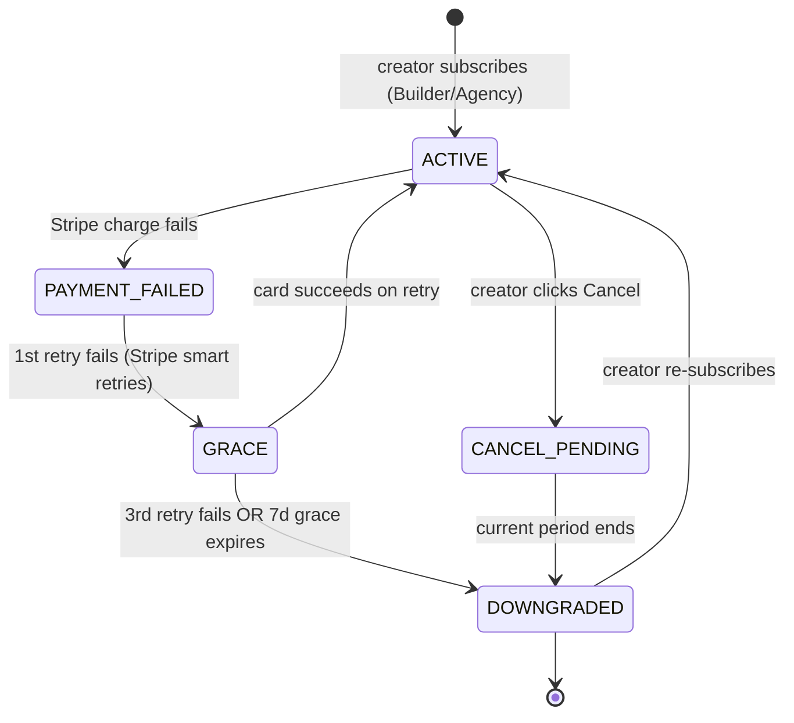

# iLaunchify Platform Spec

**Status:** Living source-of-truth. Last updated 2026-05-19. Supersedes all
prior speculation in `docs/FOD_RECOVERY_PLAN.md`, `docs/STOREFRONT.md`,
`docs/PAYMENTS.md` (where they conflict).

This document captures the locked decisions from the four-tier design session
between Pavel + Claude. Each tier is built out as we work through it.

- ✅ **Tier 1 — Business model + monetization**
- ✅ **Tier 2 — User segments + journeys**
- ✅ **Tier 3 — Operational workflows + state machines**
- ✅ **Tier 4 — Feature prioritization + V1 build sequence**

---

## Tier 1 — Business model + monetization

### What iLaunchify is

A **B2B production marketplace + manufacturing fulfillment platform** for
creators of US-compliant supplements and functional food & beverage products.
Creators browse a curated marketplace of manufacturer-listed product templates,
customize the recipe + label + packaging within compliance, place a production
order, and receive finished inventory at their warehouse (or a connected
warehouse partner). Creators then sell that inventory on their own external
channels — Shopify, Amazon, Etsy, WooCommerce, Walmart, TikTok. **iLaunchify
never touches consumer money.**

### Three party types

| Party | Role | Pays iLaunchify? | Paid by iLaunchify? |
| --- | --- | --- | --- |
| **Admin** (Pavel + team) | Runs the platform, manages partner verification, configures fees + tiers | — | — |
| **Creator** | Designs products, places production orders, sells on external channels | ✓ subscription + production order fees | — |
| **Production Partner** | Manufactures, co-packs, prints labels, or warehouses | ✓ marketplace commission on creator revenue | ✓ transfer on dispatch shipped |

Partner sub-types (via `PartnerService.type` enum):
`MANUFACTURING` · `COPACKING` · `LABEL_PRINTING` · `WAREHOUSE`

### Money flows (the only two)

```
Production order:
  Creator → iLaunchify Stripe (creator pays full production cost + platform fee)
              ↓
            iLaunchify holds funds (application fee withheld at charge time)
              ↓
            On each dispatch SHIPPED → Transfer queued to partner Stripe Connect account
              ↓
            Partner gets paid for their slice (manufacturer for product, printer for label)

Subscription (Builder / Agency):
  Creator → iLaunchify Stripe (monthly or annual)
              ↓
            iLaunchify recurring revenue. Partners don't see this.

Consumer purchases on creator's channel:
  Consumer → Creator's Shopify (or Amazon/Etsy/etc.) → Creator's connected payout account
              [iLaunchify NEVER appears in this flow]
```

### Stripe Connect setup

- iLaunchify is the **primary merchant of record** for production orders. Creator pays via Stripe Checkout.
- Partners (manufacturers, print providers, co-packers, warehouses) are **Stripe Connect Express** recipients. Transfers happen when their dispatch hits SHIPPED.
- Application fee is withheld at charge time (`payment_intent.application_fee_amount`).
- Subscription billing uses Stripe Billing (recurring) — separate from production-order Stripe Checkout sessions.

### Platform fees

All values below are **admin-editable defaults** via the Subscription & Fee Manager module (spec at the bottom of this section). They are not hardcoded.

#### Default per-tier platform fee on production orders

| Creator tier | Production-order fee |
| --- | --- |
| Maker | 15% |
| Builder | 12% |
| Agency | 9% |

#### Default per-tier marketplace commission (iLaunchify's cut of partner revenue)

| Partner tier | Marketplace commission |
| --- | --- |
| Verified | 15% |
| Trusted | 12% |
| Premier | 8% |

### Creator subscription tiers

Names (locked): **Maker → Builder → Agency**.
Billing: Maker free; Builder + Agency offer **monthly OR annual** (annual = 2 months free, equivalent to ~17% discount).

| Feature | Maker (free) | Builder (~$49–99/mo, annual ~$490–990/yr) | Agency (~$199–299/mo, annual ~$1,990–2,990/yr) |
| --- | --- | --- | --- |
| Active products | Unlimited | Unlimited | Unlimited |
| Brand profiles | 1 | 3 | Unlimited |
| Production-order fee | 15% | 12% | 9% |
| Routing priority | Standard | Priority queue | First-look |
| Channel connections (V1.1+) | 1 | 3 | All 6 |
| Sample-order fee | Standard | Discount on first sample (see activation perk) | Free + credited against main order if placed within 30 days |
| **Bulk / volume pricing visibility** | — | — | ✓ (Agency-only) |
| AI label design | Basic templates | Custom AI suggestions | Premium AI + custom templates |
| AI formulation suggestions | — | Read-only | Full editor |
| Compliance check depth | Standard | Advanced (claims dictionary) | Advanced + pre-clearance review |
| Access to Premier production partners | — | — | ✓ |
| WAREHOUSE setup fee | Pass-through | Pass-through | iLaunchify covers first month |
| Support SLA | Email, 48h | Email + chat, 24h | Dedicated account manager, 4h |
| Analytics | — | Order trends | Forecasting + capacity insights |
| Co-marketing (newsletter, case study) | — | — | ✓ |
| Early access to V1.5+ features | — | — | ✓ |

Per Pavel decision 2026-05-19: **bulk pricing is a Agency-only gate**. Builder creators see partner base prices; Agency creators see the full volume tier ladder (e.g., 500–1,999 @ $X / 2,000–9,999 @ $Y / 10,000+ @ $Z).

### Platform-wide activation perk: First Sample Discount

**Every new creator** (Maker / Builder / Agency alike) gets one **First Sample Order Discount** on their first sample order, with these constraints:
- **Up to 3 distinct products** in the sample order
- **Up to 3 units per product** (so 9 units total max)
- Discount amount: admin-editable; default proposal **50% off production cost** (covers shipping + labeling that's high per-unit on small sample runs)
- One-time per creator account (`User.firstSamplePerkUsedAt` flag)
- Doesn't stack with Agency-tier "free sample credited against main order" — Agency tier just gets the better deal automatically

Schema: `Order.firstSamplePerkApplied: Boolean @default(false)` — set when this perk consumes the user's allowance.

### Production partner tiers

Names (locked): **Verified → Trusted → Premier**.

| Feature | Verified (entry) | Trusted (proven) | Premier (top) |
| --- | --- | --- | --- |
| Active product/template listings | 3 | 25 | Unlimited |
| Marketplace commission to iLaunchify | 15% | 12% | 8% |
| Routing position | After Trusted + Premier | Before Verified | First-look |
| "Premier" badge on listings | — | — | ✓ |
| Team members on partner profile | 1 | 5 | Unlimited |
| Custom die-cut templates / quarter | 0 (standard library only) | 3 | Unlimited |
| Creator-customized recipes (slot replacements + mods) | — | ✓ | ✓ + creator-specific deal cards |
| AI partner-support agent | — | ✓ | Dedicated AI + human escalation |
| Support SLA | 48h email | 24h | 4h + dedicated AM |
| File storage | 1 GB | 10 GB | Unlimited |
| Volume discount tiers (set pricing) | — | ✓ | ✓ + creator-specific rate cards |
| Subscription reorder discounts (Subscribe & Save) | — | ✓ | ✓ |
| Order analytics dashboard | Basic | Advanced + capacity planning | Advanced + API access |
| Performance scorecard (public) | ✓ | ✓ | ✓ |
| Tier-down threshold (auto-demote) | n/a | <85% on-time OR rating drops below threshold | <90% on-time OR 2+ disputes/quarter |

**Promotion gates** (admin-editable; numbers are defaults):

- **Verified → Trusted**: 25 completed orders + 90% on-time rate + 0 unresolved disputes for 90 days
- **Trusted → Premier**: 100 completed orders + 95% on-time + dedicated account manager interview/approval

### Production partner pricing model

Partners set their own pricing. Three pricing mechanisms:

1. **Base price per unit** per service (mandatory)
2. **Volume tiers** — e.g., 500–1,999 = $X/unit, 2,000–9,999 = $Y/unit, 10,000+ = $Z/unit (Trusted + Premier only)
3. **Subscription reorder discount** — Amazon Subscribe & Save style. Creator commits to reorder every N weeks/months, gets % off per reorder (Trusted + Premier only)

**V1.5+ addition:** Creator-specific deal cards — Premier partners can negotiate custom rate cards with specific high-value creators (e.g., "Agency-tier creator with 12-month history gets 5% off all reorders").

### Sample order economics

Samples are typically small runs (5–10 units per SKU). Per-unit cost is much higher than production runs due to setup time and label print minimums. Pricing model:

| Tier | Sample order treatment |
| --- | --- |
| Maker | Pay production cost + standard platform fee (no discount) |
| Builder | First sample uses the platform-wide First Sample Discount; subsequent samples pay full production cost with no Builder-tier discount |
| Agency | First sample fully free + future samples credited against main order if creator places one within 30 days |

Sample orders flow through the same `Order` schema with a flag (`Order.orderKind: STANDARD | SAMPLE` enum). Sample orders skip channel-listing pushes and don't qualify for Subscribe & Save reorder discounts.

### Warehouse partner economics — phased

Per Pavel decision 2026-05-19, three-phase rollout:

| Phase | Model | Description | iLaunchify revenue |
| --- | --- | --- | --- |
| **V1** | Pass-through | Goods ship to warehouse partner's address. Creator-warehouse billing is direct, off-platform. iLaunchify just records the ship-to relationship. | $0 |
| **V1.5** | Pass-through + referral fee | Warehouse partners pay iLaunchify a small monthly fee or % of storage revenue in exchange for marketplace placement. | Small recurring |
| **V2** | Full intermediation | Warehouse partners publish standardized rate cards on iLaunchify. Creators select + pay iLaunchify monthly storage + per-order fulfillment. iLaunchify pays warehouse with markup. | Meaningful recurring + standardized SLAs |

### Refund / failure path policies

Documented best-practice positions; admin can adjust per case. All decisions logged to AuditLog.

| Scenario | Default policy |
| --- | --- |
| **Partner fails QC** | Partner eats cost. Creator refunded in full (minus any usable goods already delivered, e.g. labels). Partner gets reputation **strike** (3 strikes / 12 months → suspension review). |
| **Partner accepts then ghosts** | Same as QC fail. Admin manual reroute or full refund. Strike. |
| **Production matches spec but creator disputes quality** | Creator has **14 days from delivery** to file dispute. Admin arbitrates with photos + production records + partner response. Outcomes: creator wins (partner credit/refund); partner wins (no refund); ambiguous (50/50 credit). |
| **Goods damaged in transit** | Carrier insurance first. iLaunchify optional shipping insurance product (priced into platform fee at order time, V1.1+). Partner liable only if cause was inadequate packaging. |
| **Channel-side consumer returns** | Out of scope. Creator handles entirely. |
| **Stripe chargeback from creator** | Admin reviews; if creator wins, iLaunchify eats the loss (partner already paid out — not clawed back unless dispute fully resolved against partner). |
| **V2 insurance product** | "Production Protection" — creator pays extra 2% on order; iLaunchify guarantees production regardless of partner fault; iLaunchify absorbs partner failures across the pool, funded by the actuarial premium. |

Schema implications (V1.5+):
- `PartnerStrike` model (per-partner, expires after 12 months)
- `OrderDispute` model (creator-filed quality disputes, with photos + admin notes)
- `ShippingInsurance` flag on Order

### Admin Subscription & Fee Manager module (spec)

**The most important admin feature.** Every numeric value above (tier thresholds, fee percentages, feature gates, discount sizes) is DB-driven and editable from the admin UI without code deploys.

**Data model:**

```prisma
model SubscriptionPlan {
  id            String   @id @default(cuid())
  code          String   @unique          // "creator_maker", "creator_builder", "creator_master", "partner_verified", etc.
  audience      PlanAudience               // CREATOR | PARTNER
  tierName      String                     // "Maker", "Builder", "Trusted", etc.
  tierOrder     Int                        // 0, 1, 2 for sort order
  monthlyPriceCents Int    @default(0)
  annualPriceCents  Int    @default(0)
  active        Boolean  @default(true)
  // Free-form notes
  description   String?
  // Relations
  features      PlanFeature[]
  feeRules      FeeRule[]
}

model PlanFeature {
  id           String   @id @default(cuid())
  planId       String
  code         String                       // "max_products", "max_brands", "ai_label_design", etc.
  // Flexible value: int for limits, string for tier values, bool for gates
  intValue     Int?
  stringValue  String?
  boolValue    Boolean?
  // For human display
  label        String
  description  String?
  plan         SubscriptionPlan @relation(fields: [planId], references: [id], onDelete: Cascade)
  @@unique([planId, code])
}

model FeeRule {
  id           String   @id @default(cuid())
  planId       String?                       // null = global default
  triggerEvent String                        // "production_order_subtotal", "sample_order", "warehouse_referral"
  // The fee
  ratePercent  Decimal?                       // 15.0 = 15%
  flatCents    Int?                           // alternative to percent
  // Optional bounds
  minCents     Int?
  maxCents     Int?
  active       Boolean  @default(true)
  plan         SubscriptionPlan? @relation(fields: [planId], references: [id])
  @@index([planId, triggerEvent])
}

enum PlanAudience {
  CREATOR
  PARTNER
}
```

**Admin UI** at `/admin/plans`:
- List all plans grouped by audience (Creator vs Partner)
- Click a plan → editor for monthly + annual price, feature matrix (rows of `PlanFeature` with their value types), fee rules
- Promotion gate rules (e.g., "Verified → Trusted at 25 orders + 90% on-time") are also DB-driven via a `PromotionRule` model (V1.5+)
- Changes audit-logged with before/after diff
- Per Pavel decision 2026-05-19: this module is **V1 must-have**, not deferred

**Code touch points:**
- All hardcoded fee constants (`PLATFORM_FEE_BPS = 500` in `actions.ts`) are replaced by `lookupFeeRate(planId, 'production_order_subtotal')` calls
- All hardcoded tier capabilities (e.g., "Builder gets 3 brand profiles") are replaced by `lookupPlanFeature(planId, 'max_brands')` calls
- A small `@ilaunchify/plans` package owns these lookups + a cache layer

---

---

## Tier 2 — User segments + journeys

### Personas (locked per Pavel decision 2026-05-19)

**Creators — two converging sub-types, served by one product:**

| Sub-type | Who | Day-1 friction tolerance | What they need most |
| --- | --- | --- | --- |
| **Tier-1 social creator** | Influencer with 10K–100K followers, no product yet | Low — needs hand-holding | Compliance education, partner trust signals, AI design help |
| **Existing DTC brand owner** | Runs Shopify/Amazon store, currently dropships | Higher — wants speed | Fast path to first sample, real partner profiles, no fluff |

The signup wizard branches at step 1 ("Have you launched a product before?") and conditionally surfaces deeper guidance vs the express path. Both end at the same activation event.

**Production partners — three intake flows from launch:**

| Sub-type | Verification docs needed | Onboarding length |
| --- | --- | --- |
| Small US contract manufacturer | FDA establishment reg + cGMP cert + facility photos + insurance | 5–10 days (admin verification) |
| Mid-size co-packer | Same as above + SQF/BRC certification + capacity disclosure | 5–10 days |
| Print-on-demand label house | Print samples + die-cut capability + supported materials + insurance | 3–5 days |

The verification queue (Phase A) routes section requirements based on `PartnerService.type` sub-type.

### Activation moment (locked)

> **A creator becomes "real" at the moment they place + pay for their first sample order.**

Funnel metric implications:
- North-star metric: **Time to First Paid Sample** (TTFPS). Target: <30 minutes for express creators, <2 hours for guided creators.
- Every UX choice prioritizes shortening this.
- Sample order leverages the platform-wide First Sample Discount (50% off, 3 products × 3 units max).

### Creator journey — full lifecycle

**Phase 0: Discovery (pre-signup)**
- Inbound channels (V1): organic search, social, partner referrals, content marketing
- Outbound (V1.5+): direct sales to known Tier-1 creators
- Landing page: `ilaunchify.com` with category-led pitches (Supplements / Functional Drinks / Functional Food)

**Phase 1: Signup → Activation (differentiated paths per Pavel decision 2026-05-19)**

Sign up (email magic link OR Google OAuth) → 30 seconds.

Onboarding wizard branches at step 1: **"How familiar are you with selling physical products?"** → Beginner / Experienced.

| Path | Target time | Who | What happens |
| --- | --- | --- | --- |
| **Express** | **<30 min** | Experienced (existing DTC owner, sold on Etsy/Amazon before) | Skip compliance education. Single checkbox: "I confirm I have reviewed and will comply with iLaunchify's [compliance guidelines](link)." → product customize + design + sample order + Stripe Checkout. |
| **Guided** | **<2 hr** | Beginners (Tier-1 social creator, no prior product launch) | Interactive compliance primer with short quizzes (not a monolithic course): label requirements, allergen disclosure, packing types, partner trust signals. Each section gates the next but takes 5–10 min. **"I know this, skip to end" escape hatch** is visible on every screen → jumps to express completion. |

The express path is for people who already understand FDA labeling basics; the guided path teaches just enough to avoid creators getting fined or seized post-launch.

**Compliance liability protection (both paths):**
- Terms of Service: "Creator assumes all responsibility for compliance with applicable laws in their jurisdiction"
- Express skip-checkbox: "I confirm I have reviewed and will comply with iLaunchify's compliance guidelines"
- Guided escape-hatch records `User.complianceEducationSkippedAt`
- iLaunchify is a marketplace, **not** a compliance lawyer. We surface compliance violations from the rule pack engine and refuse to ship non-compliant labels, but creators sign off on the labels they approve.

**The activation event (locked):**

The CTA on the customize-complete screen is **"Try a sample (with First Sample Discount)"** — not "Publish" or "List". Every signup-to-paid path drives toward sample purchase as the activation event. The marketplace + customize UI repeatedly surfaces "Order a sample before scaling" as the recommended flow. Creators *can* skip straight to a main order, but the UI encourages sample-first.

- Sample order form pre-fills creator's address from signup
- First Sample Discount auto-applied (50% off, 3 products × 3 units max — covers the first 9 units across up to 3 SKUs)
- Stripe Checkout → ACTIVATED ✅

**Phase 2: Sample wait + validation (days 2–14)**
- Email + in-app notifications on production milestones (PRODUCING / SHIPPED / DELIVERED)
- Maker dashboard shows order status + ETA
- After delivery, prompt: "How's the sample? Ready to scale?" with "Place main order" CTA
- Optional: social-share asset (creator can post about their sample arriving)

**Phase 3: First main order (days 14–30)**
- If creator places main order → strong retention signal
- If churn risk (no main order by day 21) → re-engagement email "What's holding you back?" with offer to talk to support
- Main order MOQ depends on partner; typically 500+ units
- Creator pays full production cost + 15% platform fee (Maker tier)

**Phase 4: First sale + reorder pattern (days 30–90)**
- Goods arrive at creator's warehouse or warehouse partner
- Creator lists on their channels (V1: manually; V1.1: push-to-channel button)
- Sales accumulate on creator's channel (off-platform)
- Reorder when stock low — Subscribe & Save reorder discount available if partner offers (Trusted+ partners)

**Phase 5: Tier evolution (days 90–365)**
- In-app nudge when 2+ products active or 2+ main orders placed: "You'd save $X/year on Builder"
- Builder upgrade → unlocks unlimited products, 12% fee, AI design, sample discount on future samples
- Agency qualification: typically 5+ products active + 10+ main orders + $50K+ in production order LTV → "You qualify for Agency" prompt
- Agency perks unlock Premier partners + bulk pricing visibility + dedicated AM

**Activation success criteria:**
- TTFPS (time to first paid sample): <30 min express, <2 hr guided
- D7 retention (still active in app 7 days after signup): >40%
- Sample → main order conversion (within 30 days of sample delivery): >25%
- Builder upgrade rate (active creators on Builder/Agency after 90 days): >15%

### Production partner journey — full lifecycle

**Phase 0: Discovery**
- Inbound: organic search, content marketing, creator-to-partner organic referrals
- Outbound (V1): admin team manually sources known small US manufacturers + co-packers
- Landing page: `partners.ilaunchify.com` with capacity-led pitch (existing capacity? bring it to high-intent creators with payouts + compliance handled)

**Phase 1: Apply (day 0)**
- Public apply form on `partners.ilaunchify.com/partners/apply`
- Fields: company info, primary service type, monthly capacity, certifications, brief intro
- Creates `Partner` row in DRAFT status + `User` with PARTNER role
- Lead lands in admin's Leads inbox

**Phase 2: Qualify + invite (day 0–2)**
- Admin reviews application → qualifies → magic-link invite emailed
- Partner clicks invite → signs in → lands in onboarding wizard

**Phase 3: Onboarding wizard (days 2–7)**
- 5 steps: Company → Service profile → Documents → Stripe Connect → Review
- Service profile branches by sub-type (manufacturer vs co-packer vs label printer): different capability fields
- Document upload: required docs depend on sub-type (per the table above)
- Stripe Connect Express onboarding (partner connects their bank for payouts)
- Submit for review → status flips to UNDER_REVIEW → restricted shell (only My Application + Help visible in sidebar)

**Phase 4: Verification (days 7–14)**
- Admin reviews each of 4 sections (Business / Facility / Documents / Public Profile)
- Per-section status: Pending / Verified / Needs Changes / Rejected
- If any section needs changes, partner sees admin notes on `/my-application` → fixes → resubmits → admin re-reviews
- When all 4 sections VERIFIED → admin clicks Activate on partner detail → partner status flips to ACTIVE → full shell unlocks
- Welcome email: "You're live. Here's how to get your first order."

**Phase 5: First listing + first dispatch (days 14–30)**
- Partner adds product listings (up to 3 at Verified tier) — for manufacturers, this means a `ProductTemplate` row that creators can pick from the marketplace
- Capabilities set: MOQ, lead time, certifications, packing types supported
- First creator orders a sample featuring this partner's template → dispatch arrives
- Partner has 24h to accept → produces → ships → Transfer queued
- First payout lands in partner's Stripe Connect account → 2–7 days later in their bank
- Welcome KPI dashboard updates: 1 order completed, 100% on-time, 1 happy creator

**Phase 6: Growth to Trusted (days 30–180)**
- Continues fulfilling orders. Performance scorecard accumulates.
- Verified → Trusted gates: 25 completed orders + 90% on-time rate + 0 unresolved disputes for 90 days
- Automatic notification when eligible: "You qualify for Trusted tier. Accept to upgrade." Partner accepts → automated tier transition (no admin gate at Verified→Trusted)
- Unlocks: 25 listings + 12% commission + team members + custom die-cuts + Subscribe & Save reorder discount option

**Phase 7: Trusted → Premier (days 180–365)**
- Gates: 100 completed orders + 95% on-time + 0 quarterly dispute spikes
- Admin manual review + interview (Premier is high-touch)
- Unlocks: unlimited listings + 8% commission + featured visibility + dedicated AM + API access

**Activation success criteria:**
- Time to verification (from invite → ACTIVE): <14 days average
- First dispatch accepted: within 30 days of activation
- D90 partner retention (still ACTIVE 90 days after activation): >75%
- Promotion rate (Verified → Trusted within 180 days): >40%

### Admin journey — daily, weekly, monthly shape

**Daily (5–15 min):**
- Check notification bell: new partner applications, partner submitted-for-review, orders ON_HOLD, disputes filed
- Triage urgent items first (ON_HOLD orders, disputes)
- Quick audit log scan

**Weekly (1–2 hours):**
- Verification queue triage: review submitted partner sections
- Partner CRM: any going stale? any hitting Trusted/Premier eligibility?
- Order ops: any disputes? any stuck orders needing intervention?
- Tier promotion reviews (Trusted → Premier candidates require manual interview)
- Subscription & Fee Manager: any tier price changes? new feature gates? promo windows?

**Monthly (4–8 hours):**
- Performance metrics review (TTFPS, D7 retention, sample→main conversion, partner promotion rate)
- High-potential creator outreach (Agency tier eligibility, co-marketing)
- Partner check-ins (Trusted → Premier interviews)
- Marketplace analytics: which categories are growing, which partners are bottlenecks
- Fee tuning if a tier's conversion is off
- Quarterly: public marketplace transparency report

### Growth loops (organic, no affiliate program in V1)

Pavel-prioritized for V1 → V1.5 (2026-05-19):

| Priority | Loop | Why this ordering | Investment level |
| --- | --- | --- | --- |
| **1** | **Partner SEO inbound** | Supply-side first. Manufacturers + print providers searching "how to get wholesale orders" or "print on demand for creators" bring their existing creator networks. A single partner can onboard dozens of creators indirectly. Faster initial traction than pure creator-to-creator. Each partner profile is its own SEO landing page. | Most effort in V1: partner profile SEO optimization, schema.org markup, partner-specific landing pages. |
| **2** | **Creator-to-creator organic referral** | Critical, but a flywheel that needs ~50 active creators before it spins. Agency tier creators in newsletter + case studies become referral magnets. Word-of-mouth at conferences + Discord/Slack creator communities. | Medium effort: build the case-study template + newsletter pipeline. |
| **3** | **Transparency reports** | Underrated growth lever — treat as marketing, not just compliance. Monthly publication of marketplace metrics builds trust + shareable content + SEO. In 2025, creators care deeply about ethical manufacturing, carbon footprint, lead times. Specific metrics to publish: average QC pass rate by partner sub-type, average on-time shipping %, average lead times by category, total partner payouts (anonymized), top-rated partners (opt-in). | Medium effort: data pipeline + monthly editorial cycle. |
| **4** | **Content marketing** | Compliance guides, partner-spotlight content, "how I launched X with iLaunchify" creator stories. Slow but compounds. Keep a steady drumbeat — 1 long-form post per week. | Steady, low-bar effort. |
| **5** | **Outbound sales** | Once activation metrics are dialed (TTFPS <30 min, D7 retention >40%), hire 1–2 BDRs to source Tier-1 creators directly. Premature without solid activation metrics. | V1.5+ only. |
| **6** | **Subscribe & Save retention** | Retention loop, not acquisition — listed here for completeness. Partners offering it lock creators into predictable order cadence; creators get discounted reorders. Drives LTV up without driving new signups. | Built into V1.1 partner pricing config. |

**Transparency report cadence (V1):**
- First report: end of Q1 after public launch
- Cadence: monthly metrics dashboard (public URL) + quarterly long-form report
- Published as both blog content + PDF download (lead magnet)
- Schema: `MarketplaceMetric` model that accumulates rollups; cron job writes monthly

**Explicitly NOT in V1:** affiliate program, paid acquisition at scale (until activation is dialed), white-label landing pages for creators.

---

---

## Tier 3 — Operational workflows + state machines

This tier is split into two parts: **(A) FSMs already implemented** (documented for reference, no new design) and **(B) FSMs to design + build** (decisions made in Pavel session 2026-05-19).

Every state transition writes to `AuditLog` via `@ilaunchify/audit`. Every transition that requires user notification fires through `@ilaunchify/notifications`.

---

### A.1 Order lifecycle (built, V1)



Triggers:
- `PENDING_PAYMENT → PAID`: Stripe webhook (`handleStripeEvent`)
- `PAID → ROUTING → IN_FULFILLMENT`: `createDispatches()` in `@ilaunchify/orders/routing.ts`
- All transitions after that: per-dispatch flows roll up to order state via `count()` queries

### A.2 Dispatch lifecycle (built + B6 in progress, V1)



Edge cases:
- `qcRequired` is per `PartnerService` config (V1.1; for V1 default true for MANUFACTURING + COPACKING, false for LABEL_PRINTING)
- `SHIPPED → IN_TRANSIT` automatic 24h fallback handled by `/api/cron/auto-cancel-dispatches`-style scheduled task (B6 follow-up)
- Per-state timestamps: `acceptedAt`, `productionStartedAt`, `qualityCheckStartedAt`, `qualityCheckFailedAt`, `readyAt`, `shippedAt`, `inTransitAt`, `deliveredAt` (all on `OrderDispatch`)

### A.3 Partner lifecycle (built, V1)



UI implications:
- DRAFT/IN_PROGRESS/UNDER_REVIEW/SUSPENDED partners see the **restricted shell** (My Application + Help only)
- ACTIVE partners see the full sidebar

### A.4 Verification section lifecycle (built, V1)



Per-section type: `BUSINESS`, `FACILITY`, `DOCUMENTS`, `PUBLIC_PROFILE`. Overall partner verification status is *computed* from the four section statuses (any REJECTED → REJECTED; any NEEDS_CHANGES → NEEDS_CHANGES; all VERIFIED → VERIFIED; else PENDING).

---

### B.1 Quality dispute lifecycle (NEW — design locked 2026-05-19)

**14-day window from delivery.** After that, no dispute can be filed.



**Filing flow (creator-side):**
- Creator's `/orders/[id]` detail page shows "File quality dispute" button only while order is `DELIVERED` and within 14 days of `Order.deliveredAt`
- Form: dispute category enum (DAMAGED / WRONG_SPEC / EXPIRED / OTHER), description, photo uploads (R2)
- Submission creates `OrderDispute` row in `FILED`, locks order to `DISPUTED` status

**Investigation flow (admin-side):**
- Admin sees disputes in a new dashboard section: `/disputes` (queue with severity + age sorting)
- Detail page: dispute description + photos + production records (delivery date, partner, dispatch history)
- Admin clicks "Request partner response" → status → PARTNER_RESPONDING, notification fires to partner
- Partner has 7 days to respond via new partner-side `/disputes/[id]` page (response text + optional photos)
- If no partner response in 7d → status auto-flips back to INVESTIGATING (admin can proceed)

**Resolution outcomes:**

| Resolution | Refund | Partner consequence | Notification |
| --- | --- | --- | --- |
| `RESOLVED_CREATOR` | Full refund OR credit (admin chooses) | **Strike** (3 strikes / 12 months → suspension review) | Creator: refund issued. Partner: dispute lost, strike notice. |
| `RESOLVED_PARTNER` | None | None | Creator: dispute closed. Partner: dispute won. |
| `RESOLVED_SPLIT` | 50% credit to creator | Soft warning (not strike) | Both: 50/50 resolution. |

**Schema additions (V1):**
```prisma
model OrderDispute {
  id           String   @id @default(cuid())
  orderId      String   @unique
  filedById    String   // creator user id
  category     DisputeCategory
  description  String   // creator-written
  photoKeys    String[]                  // R2 keys
  status       DisputeStatus  @default(FILED)
  resolution   DisputeResolution?
  resolutionNotes String?
  refundCents  Int?                      // populated on resolution if applicable
  partnerResponseText String?
  partnerResponsePhotoKeys String[] @default([])
  partnerResponseDueAt DateTime?
  partnerRespondedAt   DateTime?
  resolvedAt   DateTime?
  resolvedById String?                   // admin user id
  createdAt    DateTime @default(now())
  updatedAt    DateTime @updatedAt
  order        Order    @relation(fields: [orderId], references: [id])
  filedBy      User     @relation("DisputeFiler", fields: [filedById], references: [id])
  resolvedBy   User?    @relation("DisputeResolver", fields: [resolvedById], references: [id])
}
enum DisputeCategory { DAMAGED WRONG_SPEC EXPIRED LABEL_ERROR OTHER }
enum DisputeStatus { FILED INVESTIGATING PARTNER_RESPONDING RESOLVED_CREATOR RESOLVED_PARTNER RESOLVED_SPLIT }
enum DisputeResolution { CREDIT_FULL CREDIT_HALF REFUND_FULL REFUND_HALF NO_REFUND }

model PartnerStrike {
  id          String   @id @default(cuid())
  partnerId   String
  reason      String                     // 'DISPUTE_LOST', 'QC_FAIL', etc.
  relatedDisputeId String?
  expiresAt   DateTime                   // strike +12 months
  createdAt   DateTime @default(now())
  partner     Partner  @relation(fields: [partnerId], references: [id], onDelete: Cascade)
  @@index([partnerId, expiresAt])
}
```

### B.2 Tier promotion lifecycle (NEW — design locked 2026-05-19)

Two paths: **auto-flip for Verified → Trusted** (per Pavel decision), **admin interview for Trusted → Premier**.



**Verified → Trusted (auto-flip):**
- Nightly cron evaluates: 25+ completed orders, 90%+ on-time rate (rolling 90d), 0 unresolved disputes for 90d
- When all gates met → flips `Partner.tier` to TRUSTED, writes `AuditLog` with `actorRole=SYSTEM`, fires notification: "🎉 You've been promoted to Trusted"
- Partner immediately gets the new perks (25 listings, 12% commission, etc.)
- New `PartnerTier` field on Partner: `VERIFIED | TRUSTED | PREMIER`

**Trusted → Premier (admin interview):**
- Same cron evaluates: 100+ orders, 95%+ on-time, 0 dispute spikes
- When eligible → no auto-flip. Instead, creates `TierPromotionCandidate` row, notifies admin
- Admin reviews candidate, schedules interview, approves or declines via admin UI
- Approval → `Partner.tier` flips to PREMIER, notification fires to partner
- Decline → candidate row marked DECLINED with admin notes, partner stays Trusted; reconsideration after 90d

**Tier-down (automatic):**
- Nightly cron: if a Trusted partner drops below 85% on-time for 90d, or 2+ disputes lost in a quarter → tier-down to Verified, admin notified
- Same for Premier → Trusted at <90% on-time threshold

**Schema additions (V1):**
```prisma
model Partner {
  // ... existing fields ...
  tier                PartnerTier  @default(VERIFIED)
  tierPromotedAt      DateTime?
  tierDemotedAt       DateTime?
}
enum PartnerTier { VERIFIED TRUSTED PREMIER }

model TierPromotionCandidate {
  id              String   @id @default(cuid())
  partnerId       String
  targetTier      PartnerTier                 // TRUSTED or PREMIER
  status          CandidateStatus  @default(PENDING_REVIEW)
  qualifiedAt     DateTime @default(now())
  reviewedById    String?                     // admin
  reviewNotes     String?
  reviewedAt      DateTime?
  partner         Partner  @relation(fields: [partnerId], references: [id], onDelete: Cascade)
  reviewedBy      User?    @relation("TierReviewer", fields: [reviewedById], references: [id])
  @@index([status, qualifiedAt])
}
enum CandidateStatus { PENDING_REVIEW APPROVED DECLINED }
```

### B.3 Subscription billing lifecycle (NEW — design locked 2026-05-19)

**7-day grace + 3 retry attempts → auto-downgrade to Maker** (per Pavel decision).



**Smart retry (Stripe Billing default):**
- Day 0: charge fails → PAYMENT_FAILED, email creator "card declined"
- Day 1: retry → if succeeds → ACTIVE, no UX disruption
- Day 3: retry → if succeeds → ACTIVE
- Day 7: final retry → if fails → DOWNGRADED, tier flips to Maker
- Throughout: in-app banner "Payment failed, update your card by [date]" with one-click Stripe Customer Portal link

**Downgrade behavior:**
- All creator data preserved (products, brands, recipes)
- Tier-specific perks **lock** (extra brands hidden but not deleted; AI features disabled; etc.)
- Agency-only Premier partner access reverts (creator can keep orders in flight with Premier partners but can't initiate new ones)
- Bulk pricing visibility hidden
- Re-subscribe anytime → all perks immediately restored

**Cancellation (creator-initiated):**
- Self-serve via Stripe Customer Portal
- Cancellation takes effect at end of current billing period (no proration)
- Status flips to CANCEL_PENDING, then DOWNGRADED on period end

**V1.1+: Pause-not-cancel.** Builder/Agency can pause for 1–3 months instead of cancelling. Saves churn.

**Schema additions (V1):**
```prisma
model CreatorSubscription {
  id                  String   @id @default(cuid())
  userId              String   @unique
  planId              String                       // FK to SubscriptionPlan (Tier 1 model)
  status              SubscriptionStatus  @default(ACTIVE)
  stripeSubscriptionId String  @unique
  currentPeriodEnd    DateTime
  cancelAtPeriodEnd   Boolean  @default(false)
  paymentFailedAt     DateTime?                    // first failure timestamp
  graceExpiresAt      DateTime?                    // first failure + 7d
  downgradedAt        DateTime?
  createdAt           DateTime @default(now())
  updatedAt           DateTime @updatedAt
  user                User     @relation(fields: [userId], references: [id], onDelete: Cascade)
  plan                SubscriptionPlan @relation(fields: [planId], references: [id])
}
enum SubscriptionStatus { ACTIVE PAYMENT_FAILED GRACE CANCEL_PENDING DOWNGRADED }
```

### B.4 Order cancellation paths (NEW — design locked 2026-05-19)

Three cancellation paths. All write to AuditLog with the actor role.

| Path | Allowed states | Refund | Partner consequence |
| --- | --- | --- | --- |
| **Creator pre-acceptance cancel** | PENDING_PAYMENT or PAID-but-no-dispatch-accepted | Full refund | None — no partner has committed yet |
| **Partner-requested cancel** | ACCEPTED, PRODUCING, QUALITY_CHECK | Goes through `CancellationRequest` → admin reviews | If approved: partner forfeits payment, strike. If denied: partner must fulfill. |
| **Admin force-cancel** | Any state up to SHIPPED | Full or partial refund (admin choice) | Partner clawback via `PartnerClawback` if already in production |

**Schema additions (V1):**
```prisma
model CancellationRequest {
  id           String   @id @default(cuid())
  orderId      String
  dispatchId   String?                            // null = whole-order cancel
  requestedById String                            // partner user
  reason       String
  status       CancellationRequestStatus @default(PENDING_REVIEW)
  reviewedById String?                            // admin user
  reviewedAt   DateTime?
  reviewNotes  String?
  createdAt    DateTime @default(now())
  order        Order    @relation(fields: [orderId], references: [id])
  requestedBy  User     @relation("CancellationRequester", fields: [requestedById], references: [id])
  reviewedBy   User?    @relation("CancellationReviewer", fields: [reviewedById], references: [id])
}
enum CancellationRequestStatus { PENDING_REVIEW APPROVED DENIED }
```

### B.5 Subscribe & Save reorder schedule — DEFERRED TO V1.5+

Per Pavel decision 2026-05-19. The flow involves enough complexity (partner discount tiers config, creator commitment at order time, recurring Stripe schedule, partial-fulfillment edge cases, pause/cancel) that shipping V1 without it and waiting for real demand signal is the right call.

**V1 placeholder:** `PartnerService.capabilities.supportsSubscribeAndSave: boolean` flag exists in data but isn't exposed in UI.

---

### Workflow inventory summary

| Workflow | Status | V1 / V1.1 / V1.5+ |
| --- | --- | --- |
| Order lifecycle | ✅ built | V1 |
| Dispatch lifecycle + QC + IN_TRANSIT | 🟡 B6 partial (schema + actions; UI buttons pending) | V1 |
| Partner lifecycle | ✅ built (Phase A) | V1 |
| Verification section lifecycle | ✅ built (Phase A) | V1 |
| Quality dispute lifecycle | ⚪ to build | **V1** (admin needs this on day 1) |
| Tier promotion lifecycle (auto + interview) | ⚪ to build | **V1** for Verified→Trusted; admin UI for Premier interviews can land V1.1 |
| Subscription billing lifecycle | ⚪ to build | **V1** (creators subscribing on day 1) |
| Order cancellation paths | ⚪ partial (admin only; partner-request + creator pre-accept pending) | **V1** |
| Subscribe & Save | ⚪ deferred | V1.5+ |
| Capacity calendar (partner-self-reported) | ⚪ deferred | V1.5+ |
| Sample-to-main credit (Agency tier) | ⚪ to build | **V1** (Agency tier perk) |

---

---

## Tier 4 — Feature prioritization + V1 build sequence

**V1 launch target (locked 2026-05-19):**
- **Soft launch** with 5–10 hand-picked creators + 3–5 partners
- **Disciplined 6–8 week build window**, everything non-essential pushed to V1.1
- Horizon: V1 + V1.1 only (post-launch learnings shape V2)

This Tier supersedes `docs/FOD_RECOVERY_PLAN.md`. That plan was written before the model correction (2026-05-19) and now misrepresents iLaunchify's direction. FOD_RECOVERY_PLAN.md will be archived to `docs/archived/` once Tier 4 ships.

### V1 feature inventory (organized by status)

#### ✅ Already built (Phase A + B + the storefront-reshape work)

| Surface | Feature |
| --- | --- |
| Creator | Sign in (magic-link + Google OAuth + dev-login) |
| Creator | Marketplace browse with 4-filter sidebar (category / packing / MOQ / certs) |
| Creator | Template detail + role-gated Customize CTA |
| Creator | Customize flow: slot replacements, optional ingredients, live nutrition recalc, compliance check on save |
| Creator | Production order placement form + Stripe Checkout flow + success page |
| Creator | `/products/[id]/publish` stub (channel push, V1.1 surfaces it) |
| Partner | Sign in + restricted shell pre-approval |
| Partner | 5-step onboarding wizard (company / service / documents / Stripe Connect / review) |
| Partner | Verification queue (4-section model) with admin notes + bidirectional sync |
| Partner | `/my-application` view + Edit-section deep-links |
| Partner | Orders inbox + dispatch detail with accept / decline / mark-producing / mark-ready / ship-with-tracking |
| Partner | Services list + in-portal capability editing for ACTIVE partners |
| Partner | Payments page (earnings KPIs + payouts + clawbacks) |
| Partner | File upload on documents step (R2-backed) |
| Admin | Leads inbox + qualify/disqualify + magic-link invite |
| Admin | Partner CRM (search + filter + pagination + status grouping + 4 actions) |
| Admin | "Invite partner" dialog with idempotent re-invite |
| Admin | Orders list + detail (with ship-to card + creator info + Transfer destinations) |
| Admin | Verification queue per partner (4 section pickers + notes + verifier tracking) |
| Admin | Audit log viewer with filter form |
| Admin | Channels registry page with on/off toggles |
| Admin | `/api/cron/auto-cancel-dispatches` (Vercel Cron + shared secret) |
| Platform | `@ilaunchify/audit` (writers + queries + canonical actions) |
| Platform | `@ilaunchify/notifications` (dispatcher, Resend, prefs, quiet hours) |
| Platform | `@ilaunchify/storage` (R2) |
| Platform | Notification bell + dropdown + full page + preferences (creator + admin) |
| Platform | Schema: corrected B2B production model (creator-paid orders, ship-to, WAREHOUSE service type) |
| Platform | Channel scaffolding (Channel + ChannelConnection + ChannelProductLink models seeded with 6 channels) |
| Platform | Stripe Connect Express for partners + Stripe Checkout for creators + webhook handler |

#### 🟡 In progress (finish in Week 1)

| Surface | Feature | What's left |
| --- | --- | --- |
| Partner | Dispatch QC + IN_TRANSIT buttons (B6 UI completion) | `DispatchActions.tsx` needs new buttons for `enterQualityCheck`, `failQualityCheck`, `markInTransit`, `markDelivered`; underlying actions + schema already done |

#### ⚪ V1 must-build (the 6-8 week list)

| # | Surface | Feature | Effort |
| --- | --- | --- | --- |
| 1 | Platform | **Subscription & Fee Manager** admin module (DB models + admin UI). Replaces all hardcoded fee constants with DB lookups. | L (3-5 days) |
| 2 | Platform | `@ilaunchify/plans` package with `lookupFeeRate()`, `lookupPlanFeature()`, tier gating helpers | M (2 days) |
| 3 | Creator | Subscription billing flow (Stripe Billing recurring) — subscribe to Builder/Agency, manage card via Stripe Customer Portal | M (2-3 days) |
| 4 | Creator | Tier-based feature gating throughout creator app (lock features per tier) | M (2-3 days) |
| 5 | Platform | Auto-downgrade cron: PAYMENT_FAILED → GRACE (7d) → DOWNGRADED via Stripe webhook + scheduled task | S (1 day) |
| 6 | Creator | Differentiated onboarding wizard: signup question (Beginner / Experienced) → branching → escape hatch on guided path | M (3 days) |
| 7 | Creator | Compliance education content + interactive 5-section quizzes for guided path | M (2-3 days copy-heavy) |
| 8 | Platform | `Order.orderKind: STANDARD | SAMPLE` enum + sample-specific routing logic | S (1 day) |
| 9 | Creator | First Sample Discount mechanic: per-creator `firstSamplePerkUsedAt` flag, auto-applies at checkout, 3 products × 3 units cap | S (1 day) |
| 10 | Agency tier | Sample-to-main credit logic: track delivered-sample cost, credit toward subsequent main order if placed within 30 days | M (2 days) |
| 11 | Platform | **Quality dispute system**: `OrderDispute` + `PartnerStrike` models, creator filing UI on order detail, admin arbitration dashboard at `/admin/disputes`, partner response UI | L (4-5 days) |
| 12 | Platform | **Tier promotion**: `Partner.tier` field, `TierPromotionCandidate` model, nightly cron evaluating Verified→Trusted gates + auto-flip, admin UI for Trusted→Premier interview queue | M (3 days) |
| 13 | Platform | Tier-down cron (Trusted → Verified, Premier → Trusted) on 90d sub-threshold metrics | S (1 day) |
| 14 | Platform | **Order cancellation paths**: `CancellationRequest` model, creator pre-acceptance cancel button, partner request UI, admin review queue | M (2-3 days) |
| 15 | Platform | Email transactional templates (~10-12 templates) — Resend HTML for order placed / shipped / delivered / dispute filed / dispute resolved / tier promoted / payment failed / first sample discount unlocked | M (2-3 days) |
| 15a | Creator + Partner + Admin | **Design Studio (V1: multi-surface, Path A upload + Path B template+brand-fill)** — see `docs/DESIGN_STUDIO.md`. Three-layer model (PackagingSystem → DieCutTemplate × N surfaces → LabelDesignTemplate × M per surface). Creator designs each surface (front/back/top/etc.) in turn; surface picker with completion badges; preset legal positions for compliance regions; hideable mandatory fields with AI compliance scan as compensating control. Required for any production order to ship. | XL (~4 weeks / ~19.5 days) |
| 16 | Admin | Subscription billing visibility (admin sees all creator subscriptions + can override tier manually if needed) | S (1 day) |
| 17 | Admin | Refund issuance UI for orders + dispute resolutions | S (1 day) |
| 18 | Platform | Stripe webhook integration testing (Stripe CLI + real test-mode end-to-end) | S (1 day) |
| 19 | Platform | Monitoring + alerting setup (Sentry for errors, basic uptime checks) | S (1 day) |

**Total V1 build effort: ~49-54 working days** of new code (revised after Design Studio expansion 2026-05-19 — multi-surface + AI scan additions). Assuming Pavel works ~5 days/week, that's ~10-11 weeks of focused build. **Target: ~11 weeks for V1.**

Compression options if timeline matters more than scope:
- Single-surface-only Design Studio for V1 → saves ~1 week; defer multi-surface to V1.1 (risky — most real packaging has multiple surfaces)
- Skip AI scan for hidden fields; just lock fields in V1 → saves ~1.5 days; back to original "regions locked" model
- Skip Path A (upload) for V1, ship Path B only → saves ~3 days; experienced creators churn
- Defer subscription billing to V1.1 → saves ~3 days; can't monetize on day 1

### V1.1 feature inventory (post-launch 3 months)

Items that aren't strictly necessary for soft launch but become obvious priorities once V1 is live:

| # | Feature | Why V1.1 not V1 |
| --- | --- | --- |
| V1.1-1 | **Shopify push-to-channel** (real OAuth + listing push) | Channels scaffolding lives in V1; OAuth flow + listing push deferred until creators actually have inventory to push (typically 30-60 days after launch) |
| V1.1-2 | **Subscribe & Save** (recurring reorder discount) | Complex flow; partner config + creator commit + recurring charges + partial fulfillment. Wait for real demand signal before building. |
| V1.1-3 | **Capacity calendar** (partner self-reports monthly capacity, routing respects it) | Pure optimization — V1 routing first-match algorithm works for small partner pool |
| V1.1-4 | **Conditional onboarding step engine** (region-aware: EIN for US, VAT for EU/UK) | V1 is US-only, so no region branching needed yet |
| V1.1-5 | **Partner-to-creator messaging** (admin-mediated initially) | Email is sufficient for V1; messaging is V1.1 quality-of-life |
| V1.1-6 | **Admin product moderation** (approve/reject creator-published products, bulk operations) | Only needed once creators are pushing products to channels (which itself is V1.1) |
| V1.1-7 | **Marketplace transparency report** public page + monthly cron | Needs ≥1 quarter of operational data before publishing |
| V1.1-8 | **Pause-not-cancel** for creator subscriptions | Churn-saving optimization; minor edge case in V1 |
| V1.1-9 | **Sample-side referral** (creator who placed sample referring another creator) | Organic growth loop; needs traffic to be worth building |
| V1.1-10 | **Tier 2 channels** (Amazon, Etsy, WooCommerce — beyond Shopify) | Each channel is its own integration effort; sequence after Shopify proves out |
| V1.1-11 | **AI features per tier** (AI label design improvements, AI formulation suggestions for Builder/Agency) | Defer until we know creators use the basic version |
| V1.1-12 | **Public per-creator profile pages** (creator's iLaunchify partner-side trust signal) | SEO play; not urgent for soft launch |

### Explicitly NOT in V1 or V1.1

- Affiliate / referral program (Pavel dropped 2026-05-19)
- White-label landing pages for creators
- Public API for third-party integrations
- Multi-jurisdiction expansion (EU/UK/CA)
- Beauty / skincare / pet / baby food categories
- Mobile apps
- AI formulation full editor
- Shipping insurance product
- Production-protection insurance product
- iLaunchify-owned 3PL warehouses
- White-glove agency services

### V1 build sequence (revised ~10 weeks after Design Studio inclusion)

```
Week 1: Foundation
  - Finish B6 UI (QC + IN_TRANSIT partner buttons)
  - Build Subscription & Fee Manager admin module (DB models + admin UI)
  - Refactor hardcoded fee constants → DB lookups via @ilaunchify/plans

Week 2: Subscription billing
  - Stripe Billing integration
  - Creator subscription page + Stripe Customer Portal embed
  - Tier-based feature gating helper + apply throughout creator app
  - Auto-downgrade cron + webhook handler

Week 3: Differentiated onboarding + sample mechanics
  - Branching onboarding wizard (Beginner / Experienced + escape hatch)
  - Compliance education content + 5 interactive quizzes
  - orderKind=SAMPLE enum + sample-specific flow
  - First Sample Discount mechanic
  - Sample-to-main credit (Agency tier)

Weeks 4-7: Design Studio (see docs/DESIGN_STUDIO.md)
  - Week 4: Schema (PackagingSystem + DieCutTemplate refactor + LabelDesignTemplate + DesignSurface) + migration with backfill + render + validation pipelines (Puppeteer, Ghostscript, OCR)
  - Week 5: Partner + admin PackagingSystem authoring + per-surface DieCutTemplate authoring with legal-position pickers
  - Week 6: Label-design template authoring UI + AI compliance scan integration (Tesseract + structural heuristics)
  - Week 7: Creator multi-surface studio (surface picker + brand-fill editor + upload validation UI per surface + completion checks + wire to order flow)

Week 8: Quality dispute system
  - Schema: OrderDispute + PartnerStrike
  - Creator filing UI on order detail
  - Admin /disputes dashboard + arbitration flow
  - Partner /disputes response UI
  - Notification wiring (dispute filed / partner response / resolved)

Week 9: Tier promotion + cancellation
  - Partner.tier field + TierPromotionCandidate model
  - Auto-flip cron (Verified → Trusted nightly)
  - Tier-down cron
  - Admin /admin/tier-candidates UI for Premier interview queue
  - CancellationRequest model + UIs (creator pre-accept + partner-request + admin queue)
  - Refund issuance UI

Week 10: Email + polish + admin
  - 10-12 transactional templates (Resend HTML)
  - Stripe webhook end-to-end test via Stripe CLI
  - Subscription billing admin visibility
  - Monitoring + alerting (Sentry)
  - Internal dogfood (Pavel + Simona end-to-end)

Week 11: Soft launch
  - Onboard 3-5 partners (real verification + Stripe Connect)
  - Onboard 5-10 creators (real first-sample orders)
  - Monitor + iterate on real-world feedback
```

### Soft launch readiness criteria (Definition of Done for V1)

V1 is "soft-launch ready" when **all** of these are true:

1. **End-to-end creator flow works:** sign up → guided onboarding → marketplace browse → customize → compliance pass → sample order → Stripe checkout → sample delivered → main order → main delivered → push to channel stub
2. **End-to-end partner flow works:** apply → verify (all 4 sections) → activate → first dispatch arrives → accept → produce → QC → ship → transfer paid out to Stripe Connect
3. **End-to-end admin flow works:** review verification → activate partner → see new lead → qualify → invite → handle quality dispute → arbitrate → resolve
4. **All V1 must-build items shipped** (or explicitly deferred with a V1.1 ticket)
5. **Stripe Connect tested with real test-mode transactions** (creator subscribes Builder, places production order, partner receives payout)
6. **Email transactional templates render correctly** in Gmail + Outlook + iOS Mail (visual QA)
7. **Sentry capturing errors** + at least one daily smoke test cron job
8. **Subscription & Fee Manager** lets Pavel adjust tier prices + fees without code deploy
9. **Compliance education content reviewed by a regulatory advisor** (Pavel decision: hire ad-hoc consult or use Big Law lit on FDA labeling)
10. **3-5 partners + 5-10 creators committed to soft launch participation**

### Risks + mitigations

| Risk | Likelihood | Impact | Mitigation |
| --- | --- | --- | --- |
| Stripe Connect onboarding friction for partners (banking + KYB) | High | High | Have an in-platform help video + a dedicated Pavel-or-Simona onboarding call for first 5 partners |
| Compliance education feels patronizing to experienced creators | Medium | Medium | The escape hatch ("I know this, skip to end") on every guided screen |
| First production orders fail QC | Medium | High | Manual QA on first 3 dispatches per partner before they hit ACCEPTED in production; admin can pre-flag risky orders |
| Subscription billing fails on a niche card type | Low | Medium | Stripe Billing handles this well; fallback grace period absorbs single failures |
| Soft-launch creators churn before main order | Medium | High | First Sample Discount + sample-arrives nudge email + retention call from Pavel |
| Subscribe & Save absent from V1 → reorder friction | Medium | Low | V1.1 ships within 8 weeks of launch; bridge with "Reorder" button on past orders that pre-fills the form |

---

## Open items going into V1 build

Decisions deferred until they become blocking:

1. **Subscription tier prices** — Builder $49 vs $99 vs $79; Agency $199 vs $299. Likely settled by surveying first 5 soft-launch creators' willingness-to-pay.
2. **Compliance advisor** — hire ad-hoc consult or use Big Law published material? Either is fine; consult is faster.
3. **Email sender domain reputation** — fresh Resend → may need SPF/DKIM warmup before high-volume sends.
4. **Cron infrastructure** — Vercel Cron is V1; if cron count exceeds Vercel limits, move to Fly.io scheduled worker (V1.1).

---

## Changelog

- **2026-05-19** Tier 1 locked. Affiliate program scoped out. Builder bulk-pricing access moved to Agency-only. Platform-wide First Sample Discount perk added.
- **2026-05-19** Tier 2 locked. Personas, activation moment (first paid sample), full lifecycle journeys for creator + partner + admin, growth loops (organic only in V1).
- **2026-05-19** Tier 2 refinements: differentiated onboarding paths (express <30 min with compliance waiver vs guided <2 hr with interactive quizzes + escape hatch); growth loops reordered with partner SEO at #1 + transparency reports promoted to #3.
- **2026-05-19** Tier 3 locked. 4 existing FSMs documented (Order / Dispatch / Partner / Verification section). 4 new FSMs designed (Quality dispute 14d window; Verified→Trusted auto-flip + Trusted→Premier admin interview; subscription billing with 7d grace + auto-downgrade to Maker; order cancellation with 3 paths). Subscribe & Save deferred to V1.5+. Schema additions: OrderDispute, PartnerStrike, TierPromotionCandidate, CreatorSubscription, CancellationRequest + Partner.tier enum.
- **2026-05-19** Tier 4 locked. V1 launch target: soft launch 5-10 creators + 3-5 partners. Build window: 6-8 weeks disciplined. V1 + V1.1 spec horizon. ~30-35 working days of new code estimated. FOD_RECOVERY_PLAN.md to be archived once Tier 4 ships (it predated the model correction).
- **2026-05-19** Design Studio spec locked in `docs/DESIGN_STUDIO.md`. V1 ships Path A (upload) + Path B (template + brand-fill). Adds ~13.5 days / ~3 weeks to V1 build. Total V1 effort revised to ~43-48 working days / ~10 weeks. Build sequence updated to slot Design Studio at Weeks 4-6.
- **2026-05-19** Design Studio expanded to multi-surface model (PackagingSystem → DieCutTemplate × N → LabelDesignTemplate × M per surface) + AI compliance scan for hidden mandatory fields. Reflects real packaging which has multiple printable surfaces. Adds ~6 days. Total V1 effort: ~49-54 days / ~11 weeks. Build sequence: Design Studio now Weeks 4-7; remaining work pushed to Weeks 8-11.
- **2026-05-28** Creator tier #3 renamed: **Master → Agency** (better aligns with influencer-agency persona). Maker tier active-product cap lifted: 1 → Unlimited (revenue comes from production fees, not product creation; brand-profile count remains the real upgrade lever at 1/3/Unlimited). TierKey type in `packages/ui/src/components/pricing-tier-data.ts` renamed from `'master'` to `'agency'`. Pricing page + UserMenu + PricingTierModal updated.
